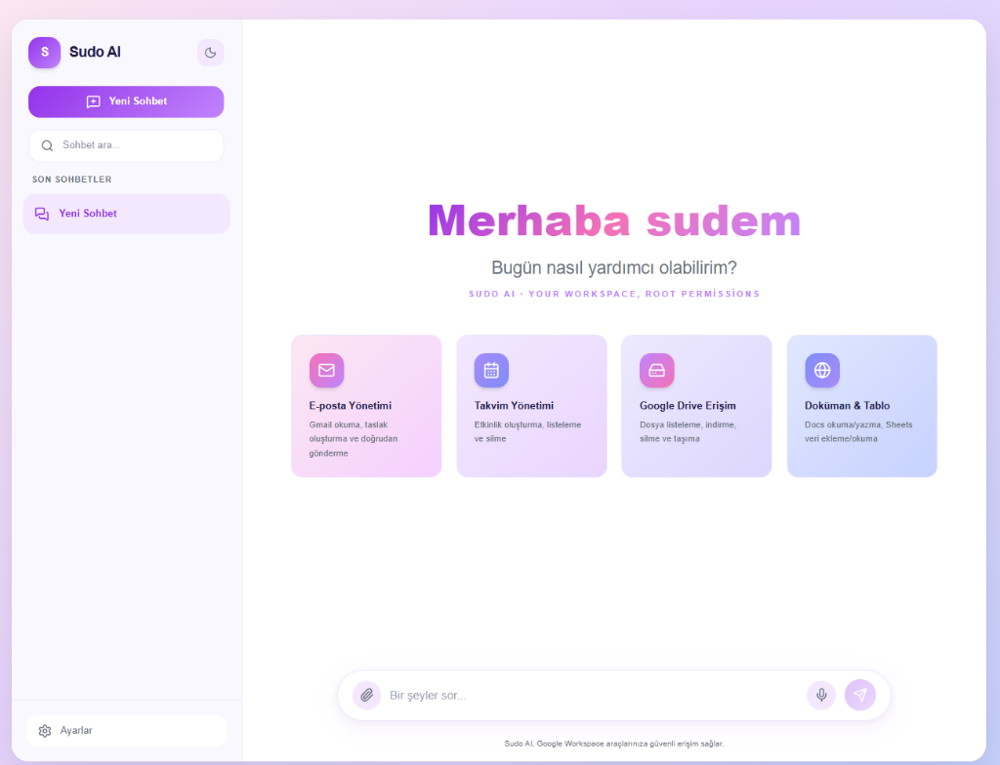

# Sudo AI — Premium Google Workspace Agent

<div align="center">
  
</div>

<p align="center">
  
  
  
</p>

**Sudo AI**, günlük **Google Workspace** işlerinizi (Gmail, Takvim, Drive, Docs, Sheets, Slides) doğal dille yönetmenizi sağlayan yüksek yetenekli, *ReAct (Reasoning and Acting)* mantığıyla çalışan premium bir yapay zeka asistanıdır. Google'ın bulut yapay zeka servisleri ile sistem araçlarını entegre ederek tamamen size özel, otonom bir "SaaS" (Hizmet olarak Yazılım) deneyimi sunar.

---

## ✨ Öne Çıkan Özellikler

- 🎨 **Premium UI/UX:** Apple/SaaS standartlarında pastel renk paleti, pürüzsüz "düşünüyor" (typing) animasyonları ve şık baloncuk tasarımlarına sahip modern React arayüzü.
- ⚙️ **Çoklu Model Desteği:** Google Gemini (Bulut) veya sisteminizde çalışan yerel modeller (Ollama) arasında anında geçiş imkanı.
- 🎙️ **Text-to-Speech (Seslendirme):** Doğal Türkçe kadın sesleriyle asistan yanıtlarını dinleme özelliği (URL'ler ve kod blokları akıllıca filtrelenerek okunur).
- 📎 **RAG (Belge ile Sohbet):** Sürükle-bırak desteğiyle PDF ve TXT yükleme, döküman sentezleri üzerinden spesifik belgelerle sohbet edebilme becerisi.
- 📆 **Tek Tık Aksiyonları:** "Docs'a Aktar" ve "Takvime İşle" butonlarıyla sohbet içeriklerini saniyeler içinde Google servislerine otomatik yazdırma.
- 🔒 **Tam Kontrol ve Güvenlik:** Sudo AI, e-posta göndermeden veya etkinlik oluşturmadan önce *Local OAuth* (Yerel yetkilendirme) kullanır. Verileriniz (sohbet geçmişiniz dâhil) tamamen sizin makinenizde işlenir ve saklanır.

---

## ☁️ Desteklenen Google Araçları

Sudo AI sadece metin üretmez, doğrudan hesaplarınızda *gerçek işler* yapar:
- **📩 Gmail:** Yeni taslak e-postalar hazırlar.
- **📅 Takvim:** Gündeminizi sorgular, yepyeni toplantılar planlar.
- **📂 Drive:** Son yüklenen dosyalarınızı listeler ve doğrudan indirme bağlantılarını getirir.
- **📝 Docs:** Kayıtlı dökümanlarınızı okuyup analiz eder veya sıfırdan döküman yaratır.
- **📊 Sheets:** E-Tabloların (Excel) son satırına yeni veri setleri veya analizler ekler.
- **🖥️ Slides:** Hazırlık için boş bir sunum dosyası yaratır.

---

## 🚀 Adım Adım Kurulum Rehberi

Projeyi kendi bilgisayarınızda (localhost) çalıştırmak ve kullanmak için lütfen aşağıdaki adımları sırayla izleyin.

### 📋 Ön Gereksinimler
Sisteminizi kurmadan önce bilgisayarınızda şunların kurulu olduğundan emin olun:
- **Python 3.8 veya üzeri**
- **Node.js (v18+)** ve npm (React arayüzü için)
- Bir **Google Cloud Platform (GCP)** hesabı

### 1️⃣ Google Cloud API (OAuth) Kurulumu
Google hesaplarınızda işlem yapabilmek için uygulamaya bir yetkilendirme (kimlik) dosyası tanımlamamız gerekiyor:
1. [Google Cloud Console](https://console.cloud.google.com/)'a gidin ve yeni bir proje oluşturun.
2. Gezinme menüsünden **API'ler ve Hizmetler (APIs & Services) > Kitaplık (Library)** sekmesine girin.
3. Şu API'leri aratıp aktifleştirin: `Gmail API`, `Google Drive API`, `Google Calendar API`, `Google Docs API`, `Google Sheets API`, `Google Slides API`.
4. **OAuth Onay Ekranı (OAuth Consent Screen)**'nı yapılandırın ("Harici / External" tipi önerilir, Test kullanıcısı olarak kendi e-postanızı ekleyin).
5. **Kimlik Bilgileri (Credentials) > Kimlik Bilgisi Oluştur (Create Credentials)** sayfasından **"OAuth 2.0 İstemci Kimlikleri (Desktop App / Masaüstü Uygulaması)"** seçeneğiyle bir anahtar oluşturun.
6. Oluşan `.json` dosyasını indirin. Dosyanın adını tam olarak `credentials.json` yaparak bu projenin ana (root) klasörünün içine bırakın.

### 2️⃣ Ortam Değişkenleri (.env)
Proje ana dizininde (root) `.env` isminde gizli bir dosya oluşturun ve Google Gemini API anahtarınızı tanımlayın:
```env
GEMINI_API_KEY=sizin_gemini_api_anahtariniz_buraya
# OLLAMA_HOST=http://localhost:11434 (Eğer Ollama kullanacaksanız ve farklı bir porttaysa aktif edin)
```

### 3️⃣ Backend (FastAPI Sunucusunu) Başlatma
Terminalinizi proje ana klasöründe açın ve sırasıyla şunları çalıştırın:
```bash
# Sanal ortam (virtual environment) oluşturma
python -m venv venv

# Windows için sanal ortamı etkinleştirme:
venv\Scripts\activate
# (macOS/Linux için: source venv/bin/activate)

# Gerekli Python bağımlılıklarını kurma
pip install -r requirements.txt

# FastAPI sunucusunu başlatma
python -m uvicorn main:app --reload --port 8000
```
> **Not:** İlk çalıştırma (veya ilk promptunuzu yazdığınız) esnada tarayıcınızda bir **Google Hesabınıza giriş yapın** ekranı açılacaktır. İzinleri onayladıktan sonra `token.json` dosyası otomatik oluşturulup arka planda Google Workspace yetkilendirmesi tamamlanacaktır.

### 4️⃣ Frontend (React Arayüzünü) Başlatma
Backend çalışırken onu kapatmadan **yeni (ikinci)** bir terminal veya CMD sekmesi açın ve `frontend` klasörüne girin:
```bash
cd frontend

# React için gereken Node modüllerini (Tailwind, Lucide vb.) yükleme
npm install

# Geliştirme (Development) sunucusunu başlatma
npm run dev
```
Uygulamanız başarıyla **`http://localhost:5173/`** adresinde ayağa kalkacaktır! Tarayıcıdan bu linki açarak asistanla sohbete başlayabilirsiniz. 🎉

---

## 📂 Proje Klasör Yapısı (Architecture)

Projeyi geliştirmek veya kodları incelemek isteyenler için dizin ağacı:

```text
sudo-ai/
├── ⚙️ Backend (Python / FastAPI)
│   ├── main.py              # Rest API'ler, RAG (Yükleme) fonksiyonları ve asistan stream döngüsü
│   ├── database.py          # SQLAlchemy şemaları (Conversations, Messages) ve SQLite entegrasyonu
│   ├── tools.py             # LLM ReAct sistem komutları (Prompt) ve asıl Google Workspace fonksiyonları
│   ├── auth.py              # Google OAuth 2.0 flow ve Token yönetimi (credentials.json okuma)
│   └── requirements.txt     # Backend paket gereksinimleri (pydantic, fastapi, sqlalchemy vb.)
│
├── 🎨 Frontend (React / Vite)
│   ├── vite.config.js       # Vite sunucu yapılandırması
│   ├── package.json         # Node bağımlılıkları ve Script'ler
│   └── src/
│       ├── App.jsx          # Ana layout, asistan durum (State) yönetimi
│       ├── index.css        # Tailwind direktifleri ve asistan düşünme (typing) animasyonları
│       ├── services/api.js  # FastAPI backend'i ile haberleşen proxy servisleri
│       └── components/
│           ├── ChatArea.jsx # Sohbet penceresi modeli, Bouncing Dots (Düşünüyor) efekti, TTS modülleri
│           ├── ChatInput.jsx# Alt metin giriş kutusu, sürükle-bırak (Drag&Drop) ile RAG modülü
│           ├── Sidebar.jsx  # Sol yönlendirme ve geçmiş sohbetlerin listelenmesi
│           └── Welcome.jsx  # Sohbet yoksa açılan dinamik Onboarding ve Karşılama Ekranı
```

---

## 💡 Nasıl Kullanılır (Kullanım Senaryoları)

- **Karşılama Ekranı:** İsminizi girerek (veya doğrudan) asistanı başlatın. İsim cihazınızın LocalStorage verisinde tutulur.
- **Doğrudan Emirler Verin:**  
  *"Önümüzdeki hafta perşembe saat 14:00'te 'Proje Sunumu' adında bir etkinlik oluştur"* dediğiniz an asistan bunu saniyeler içinde Google Takviminize ekleyecektir.
- **Rapor Yazdırın:**  
  PDF raporunuzu 'Ataç 📎' ikonuyla chate yükleyin, ardından *"Bu rapordaki temel risk faktörlerini bana liste yap, ardından bunu yeni bir mesajla Google Docs dökümanı olarak kaydet"* komutunu verin.
- **Akıllı Düzenleyiciler:**  
  Asistan içeriği üretir üretmez baloncuğun altındaki "📄 Docs'a Aktar" veya "📅 Takvime İşle" butonuna tek bir defa tıklarsanız arka planda gizli promptlar (ReAct) üzerinden bu bilgileri otomatik kaydeder.
- **Uygulama Ayarları (⚙️):**  
  Sol alttaki "Ayarlar" butonundan sistem API durumunu veya varsayılan Büyük Dil Modellerini (Gemini, Ollama vb.) görüntüleyebilir/seçebilirsiniz.

---
**📍 Güvenlik İpuçları:** 
- `credentials.json`, `token.json` veya `.env` dosyalarını hiçbir public platformda (GitHub vb.) paylaşmayınız. Bu proje altyapısı gereği tüm `.gitignore` ayarlarına sahiptir ancak bireysel önlem esastır.
- Bu proje, sohbet günlüğünü kaydetmek için varsayılan olarak `sudo_ai.db` isimli yerel bir **SQLite** veritabanı kullanır ve hiçbir veriyi 3. parti sunuculara (LLM modellerini işleyen Google/Ollama hariç) göndermez.
